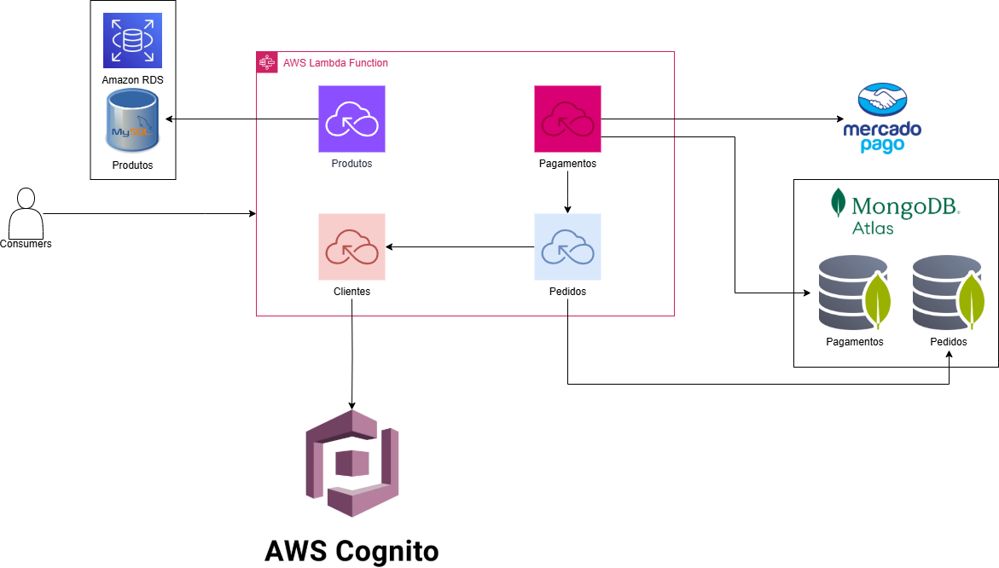
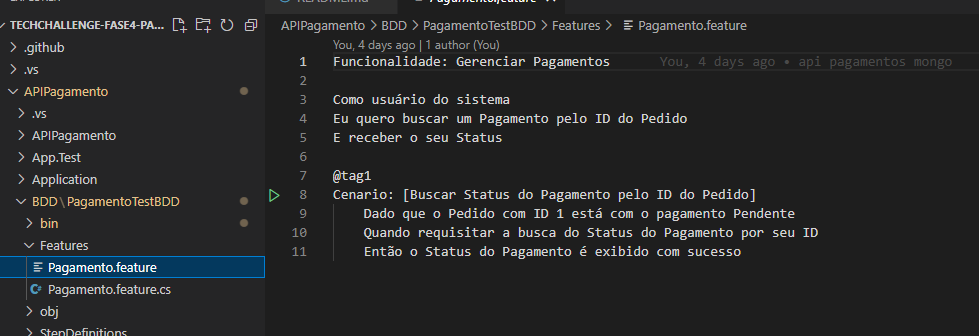

# TechChallenge FIAP - G24 FASE 4

## API PAGAMENTOS

## Grupo 24 - Integrantes
💻 *<b>RM355456</b>*: Franciele de Jesus Zanella Ataulo  
💻 *<b>RM355476</b>*: Bruno Luis Begliomini Ataulo  
💻 *<b>RM355921</b>*: Cesar Pereira Moroni  

## Nome Discord:
Franciele RM 355456 
Bruno - RM355476 
Cesar P Moroni RM355921 c

Este repositório é dedicado ao microsserviço de pagamentos. Neste foi utilizado o mongoDB como banco de dados

O deploy deste foi feito Utilizando aws Lambda - serveless análise de código e cobertura de testes utilizando SonarCloud são realizados via Github Actions.

## Desenho da Arquitetura

Quando disparamos a Github Action, é realizado o build da aplicação e deploy na LAMBDA . Desenho com detalhes da infraestrutura do software

## Banco de Dados NOSQL -  MONGO DB

## Teste unitario

Utilizamos a ferramenta xUnit para realizar os testes unitários

## Sonar

Utilizamos a ferramenta SonarCloud para análise de código e cobertura de testes. Para este microsserviço, atingimos acima de 80% de cobertura, conforme abaixo:

#BDD

Utilizamos BDD para buscar o status do pagamento pelo idPedido:

